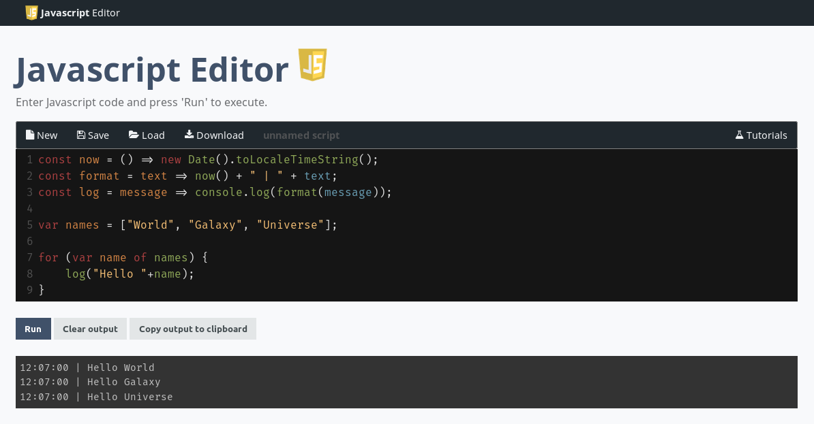

# Javascript Editor
Simple online Javascript editor, for teaching purpose.

Visit it here: [https://www.frostnova.ch/javascript](https://www.frostnova.ch/javascript/)

**Features:**
- Uses  **[Codemirror](https://codemirror.net/)** for syntax highlighting and autocompletion.
- Scripts can be locally saved (local storage) and will be available again on reload.
- Download function for current script
- Console HTML output with copy-to-clipboard function
- (incubation) Tutorials for learning Javascript

